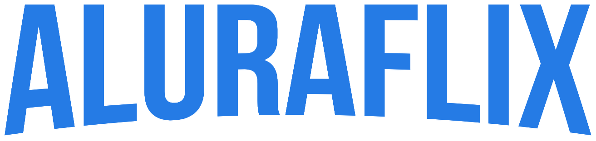

# 

## Descrição do projeto

[Acesse o projeto](https://alura-flix-imersao-alura-react.vercel.app/)

Este projeto é um repositório de vídeos da Alura. Foi criado no evento Imersão Alura - React

## Començando

* [NodeJs](https://nodejs.org/en/);
* Editor de código como [Visual Studio Code](https://code.visualstudio.com/);

## Començando

* Fork esse projeto;
* Rode `npm install`; 
* Rode `npm start`.

Prontinho!
